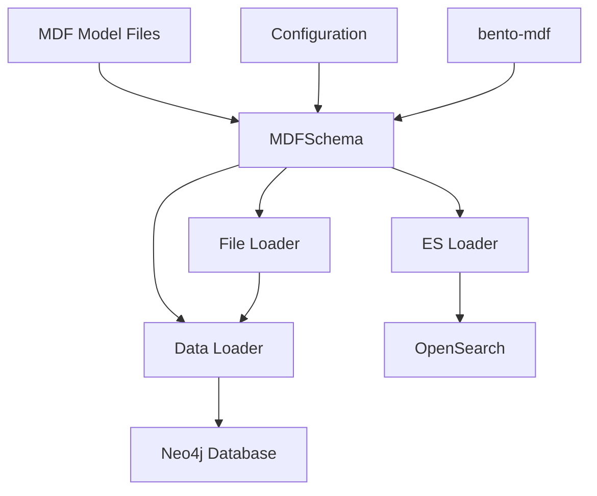

# Design Document

*Created by Kiro*

## Overview

The MDF refactor transforms the Bento data loader from a hardcoded ICDC/C3DC-specific system into a model-agnostic platform that can work with any Model Description Format (MDF) model. The design centers around replacing the `ICDC_Schema` class with a new `MDFSchema` class that integrates with bento-mdf for model parsing, validation, and data processing. This architectural change enables the same codebase to support multiple cancer research projects and data models without modification.

## Architecture

The refactored system maintains the existing data loading pipeline while replacing the schema layer with MDF-based components. The new architecture introduces clean separation between model definition (MDF files) and data processing logic.



### Key Architectural Changes

1. **Schema Layer Replacement**: Replace `ICDC_Schema` with `MDFSchema` that uses bento-mdf
2. **Configuration-Driven Models**: MDF model specification through configuration files
3. **Dynamic Model Loading**: Runtime model loading and validation
4. **Model-Agnostic Processing**: Generic data processing that adapts to any MDF model

## Components and Interfaces

### Schema Adapter Class

**Purpose**: Replaces `ICDC_Schema` as the central schema management component, providing an adapter interface between the existing data loader API and bento-mdf classes.

**Key Methods**:
- `load_mdf_model(model_path)` - Loads MDF model using bento-mdf `MDF` class (validation handled by bento-mdf)
- `get_node_properties(node_type)` - Returns properties using `MDF.model.nodes`
- `get_relationships()` - Returns relationships using `MDF.model.edges`  
- `validate_data_record(record)` - Validates data against MDF model structure
- `get_property_type(node_type, property)` - Returns property types from `MDF.model.props`

**Integration with bento-mdf**:
```python
from bento_mdf import MDF

class SchemaAdapter:
    def __init__(self, mdf_model_path, props=None):
        self.mdf = MDF(mdf_model_path)  # Use bento-mdf MDF class
        self.props = props or Props()
        
    def get_node_properties(self, node_type):
        # Use MDF.model attribute to access nodes
        node = self.mdf.model.nodes.get(node_type)
        return {prop.handle: prop for prop in node.props.values()} if node else {}
```

### Configuration System Updates

**Purpose**: Enable MDF model specification through configuration files instead of hardcoded schemas.

**New Configuration Structure**:
```yaml
Config:
  # MDF Model Configuration
  mdf_model:
    path: "models/my-project-model.yaml"
    # Alternative: Git repository
    repository: "https://github.com/org/project-model.git"
    branch: "main"
    
  # Existing configuration continues...
  neo4j:
    uri: "bolt://localhost:7687"
```

**Configuration Loader**:
- Parse MDF model specifications from config files
- Support local file paths and Git repositories for MDF models
- Validate MDF model accessibility before system startup

### Data Processing Pipeline Updates

**Purpose**: Modify existing data processing components to work with generic MDF models instead of hardcoded schemas.

**Updated Components**:

1. **DataLoader Class**:
   - Replace `ICDC_Schema` dependency with `MDFSchema`
   - Update node and relationship creation to use MDF model definitions
   - Modify validation logic to use MDF constraints

2. **FileLoader Class**:
   - Update schema references to use `MDFSchema`
   - Modify file processing to work with any MDF model structure

3. **ESLoader Class**:
   - Update index creation to use MDF model node and property definitions
   - Modify query generation to work with generic MDF models

### Plugin System Updates

**Purpose**: Update loader plugins to work with MDF models instead of hardcoded ICDC schemas.

**Plugin Interface Changes**:
```python
class PluginBase:
    def __init__(self, schema_adapter):
        self.schema = schema_adapter  # Now receives SchemaAdapter instead of ICDC_Schema
        
    def should_run(self, node_type, event):
        # Use MDF model through schema adapter to determine if plugin should run
        return node_type in self.schema.mdf.model.nodes
```

## Data Models

### Using bento-mdf Classes

The system will use the bento-mdf MDF class and access model components through its model attribute:

- **`MDF`** - Main MDF parser and container class
- **`MDF.model`** - The parsed model object containing nodes, edges, properties, and terms
- **`MDF.model.nodes`** - Dictionary of Node objects accessed by handle
- **`MDF.model.edges`** - Dictionary of Edge objects accessed by handle  
- **`MDF.model.props`** - Dictionary of Property objects accessed by handle
- **`MDF.model.terms`** - Dictionary of Term objects for controlled vocabularies

### Configuration Model

```python
class MDFConfig:
    model_source: str  # File path to MDF YAML files
    model_files: List[str]  # List of MDF model files (nodes, relationships, etc.)
    validation_level: str  # strict, permissive, etc.
```

## Error Handling

### MDF Model Loading Errors

1. **Model File Not Found**
   - Clear error message with file path
   - Suggestions for correct path format
   - Fallback to default model if configured

2. **Model Parsing Errors**
   - Pass through bento-mdf parsing error messages
   - Rely on bento-mdf validation and error reporting
   - Handle MDF parsing exceptions gracefully

### Data Processing Errors

1. **Data Validation Against MDF Model**
   - Property type mismatches
   - Missing required properties
   - Constraint violations

## Testing Strategy

### Unit Tests

1. **Schema Adapter Tests**
   - Test bento-mdf Model loading with various MDF formats
   - Test property and relationship extraction using bento-mdf classes
   - Test data validation using bento-mdf validation methods

2. **Configuration System Tests**
   - Test MDF model path resolution
   - Test Git repository model loading
   - Test configuration validation

3. **Data Processing Tests**
   - Test data loading with different MDF models
   - Test relationship creation with MDF definitions
   - Test validation with various MDF constraints

### Integration Tests

1. **End-to-End Model Loading**
   - Test complete data loading pipeline with real MDF models
   - Test system behavior with different model complexities
   - Test performance with large MDF models

2. **Multi-Model Testing**
   - Test system with various cancer research MDF models
   - Test compatibility across different MDF model versions

### Model Compatibility Tests

1. **Real-World MDF Models**
   - Test with actual bento-mdf models from different projects
   - Validate against known good data sets
   - Performance benchmarking against hardcoded version

## Implementation Phases

### Phase 1: Build System and MDF Integration Foundation
- Migrate to uv build system with pyproject.toml
- Integrate bento-mdf dependency
- Create SchemaAdapter class that wraps bento-mdf Model
- Update configuration system for MDF model specification

### Phase 2: Core Schema Replacement
- Replace ICDC_Schema with SchemaAdapter in core components
- Update DataLoader class to use bento-mdf Model objects
- Modify data validation logic to use bento-mdf validation methods

### Phase 3: Component Updates
- Update FileLoader and ESLoader for MDF compatibility
- Modify plugin system to work with MDF models
- Update index creation and query generation

### Phase 4: Configuration and Documentation
- Update all configuration files to use MDF model specifications
- Remove hardcoded ICDC/C3DC references throughout codebase
- Update documentation to reflect MDF-based architecture

### Phase 5: Testing and Validation
- Comprehensive testing with multiple MDF models
- Performance validation and optimization
- Integration testing with real-world scenarios

## Migration Strategy

### Code Changes Required

1. **File Modifications**:
   - `icdc_schema.py` → `schema_adapter.py` (rewrite to use bento-mdf Model)
   - `data_loader.py` - Update to use SchemaAdapter and bento-mdf classes
   - `loader.py` - Update schema instantiation to use bento-mdf Model
   - `file_loader.py` - Update to use bento-mdf Node and Property objects
   - `es_loader.py` - Update queries to use bento-mdf model structure
   - All plugin files - Update to use bento-mdf classes

2. **Configuration Updates**:
   - Update all YAML configuration files
   - Remove hardcoded model references
   - Add MDF model path specifications

3. **Documentation Updates**:
   - Update README.md to reflect MDF-based architecture
   - Update all documentation files
   - Create MDF model usage guides

### Build System and Dependency Changes

1. **Build System Migration**:
   - Replace requirements.txt with pyproject.toml
   - Configure uv as the build system
   - Set up modern Python packaging standards

2. **Add Dependencies**:
   - `bento-mdf` - Core MDF parsing and validation
   - `bento-common` as Git dependency (replacing submodule)
   - Any additional dependencies required by bento-mdf

3. **Remove Dependencies**:
   - Remove any ICDC/C3DC specific dependencies
   - Clean up unused imports and references

4. **Future Enhancement**:
   - Nice-to-have: A refactored bento-common that is properly packaged with uv based on pyproject.toml, which would allow it to be published to PyPI and used as a regular dependency rather than a Git dependency

## Specific Implementation Details

### MDF Model Loading

```python
def load_mdf_model(self, model_files):
    """Load MDF model using bento-mdf MDF class"""
    try:
        from bento_mdf import MDF
        mdf = MDF(model_files)  # Pass list of MDF YAML files
        return mdf
    except Exception as e:
        self.log.error(f"Failed to load MDF model from {model_files}: {e}")
        raise
```

### Dynamic Property Resolution

```python
def get_node_properties(self, node_type):
    """Get properties for a node type using MDF.model.nodes"""
    node = self.mdf.model.nodes.get(node_type)
    if not node:
        raise ValueError(f"Node type {node_type} not found in MDF model")
    
    # Return bento-mdf Property objects from the node
    return {prop.handle: prop for prop in node.props.values()}
```

### Generic Validation

```python
def validate_data_record(self, record, node_type):
    """Validate data record using MDF model structure"""
    node = self.mdf.model.nodes.get(node_type)
    if not node:
        return False, f"Unknown node type: {node_type}"
    
    # Validate against node properties from MDF model
    for prop_handle, prop_value in record.items():
        prop = node.props.get(prop_handle)
        if prop and not self._validate_property_value(prop, prop_value):
            return False, f"Invalid property {prop_handle}: {prop_value}"
    
    return True, "Valid"
```